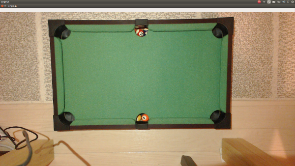
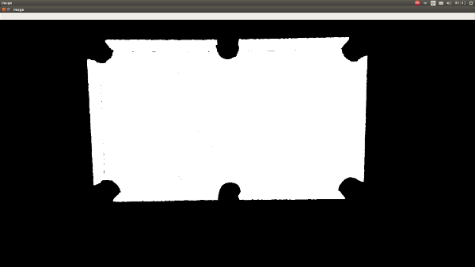
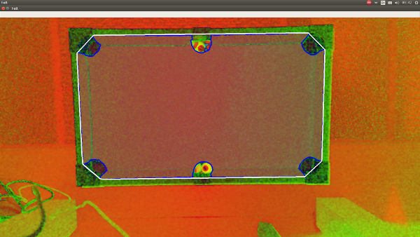
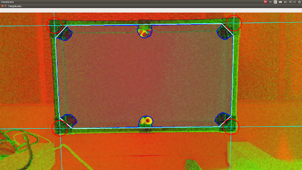
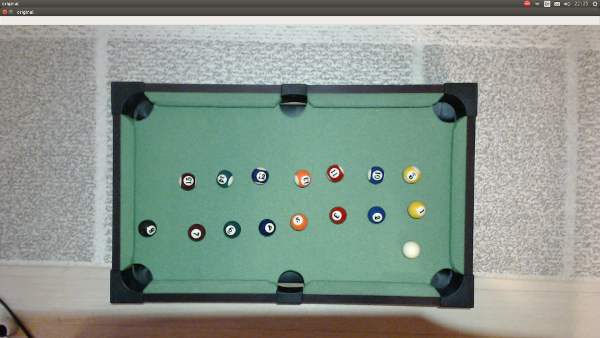
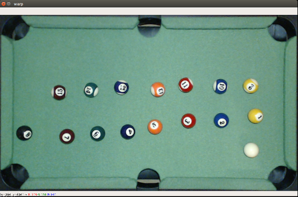
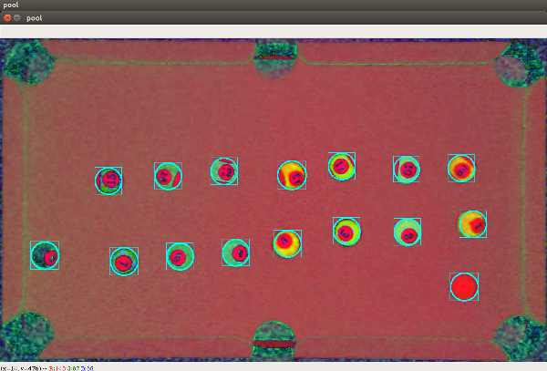
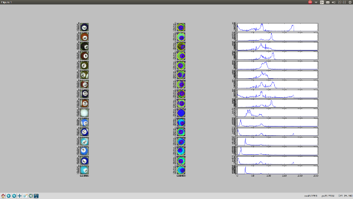

study openCV using billiards pictures
---

# 概要

ビリヤードの画像を解析し、ボールの移動などをプログラムで扱えるようにする実験を行う。
目的はopenCVの勉強。
Webで検索すると同じような試みはいくつもあるので目新しいものではない。

# TODO

- [x] 台のエッジを抽出する
- [x] ボールのエッジを抽出する
- [x] ROI（関心領域）の切り出し
  - [x] 台をまずは台形として認識できるように四隅の座標を求める
  - [x] 台形補正を行い、ビリヤード台よりも外側を削除
- [x] ボールの輪郭をより正確に取れるようにする
- [ ] ボールの種類（番号）を認識できるようにする
  - [ ] 色の判定
  - [ ] ストライプの有無の判定 <- これが難しい
    - 番号が上に向いているときは簡単で白色の割合や番号自体を読み込める
    - それ以外の場合のバリエーションが多く判定が難しい。
    - 機械学習を利用するべきかもしれない
  - 一旦保留する
- [ ] ビリヤード台とボールをオブジェクトとして抽象的に認識できるようにする
- [ ] 画像中に台に人やキューが入ってきた時に認識を阻害しないようにする
  - [ ] 動画の場合は背景差分を利用すれば行けると思われる
- [ ] ボールの軌跡を追跡できるようにする

# 条件緩和

- 台の中央から撮影した画像だけ対応
- 証明などの条件は実験環境に限定する。各種パラメタは状況に応じて調整するようにする。

# 更新履歴

- 2017/09/13 台とボールのエッジ抽出ができるようになった。
  - 台が台形になっている（中心から撮影出来てないため）のを補正する必要があるかも
  - ボールのエッジがややずれている。特に2番のボールがかなりずれている
- 2017/09/21
  - 台に台形補正をかけるためには台形の4つの角を調べる必要があるので以下を実施
  - 元画像
  - 
  - 緑色でフィルタをかけて台だけを抽出した
  - 
  - 輪郭抽出と穴を補完させた
  - 
  - 直線検出を行い、直線の交点に円を描いた
  - 
- 2017/09/22
  - 台にボールを載せた
  - 
  - 台形補正をして、かつ台よりも外側を削除した
  - 
  - 改めて球をハフ変換で認識したうて外接矩形を描画した
  - 
  - 球の画像だけ切り取り、それぞれの画像のヒストグラムを調べた
  - 

# 道具

- [カイザー(kaiser) ビリヤード セット KW-645](https://www.amazon.co.jp/%E3%82%AB%E3%82%A4%E3%82%B6%E3%83%BC-kaiser-%E3%83%93%E3%83%AA%E3%83%A4%E3%83%BC%E3%83%89-KW-645-%E3%83%86%E3%83%BC%E3%83%96%E3%83%AB/dp/B005IO0Z62/ref=sr_1_4?ie=UTF8&qid=1505972177&sr=8-4&keywords=%E3%83%93%E3%83%AA%E3%83%A4%E3%83%BC%E3%83%89%E5%8F%B0)
  - 小型のビリヤード台
  - 実験に最適
- [Logicool HD Pro Webcam C920r](https://www.logicool.co.jp/ja-jp/product/hd-pro-webcam-c920)

# 参照

- [画像処理入門講座 : OpenCVとPythonで始める画像処理](http://postd.cc/image-processing-101/)
- [Pool_detection_and_path_identification_with_OpenCV](http://curvetube.com/Pool_detection_and_path_identification_with_OpenCV/_3MW_o9KAWs.video)
- [POOL­AID: Detection and Identification of Pool Balls for the purpose of recommending shots to beginner players.](http://kastner.ucsd.edu/ryan/wp-content/uploads/sites/5/2014/03/admin/pool-aid.pdf)
